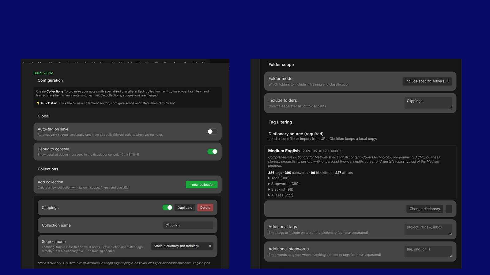
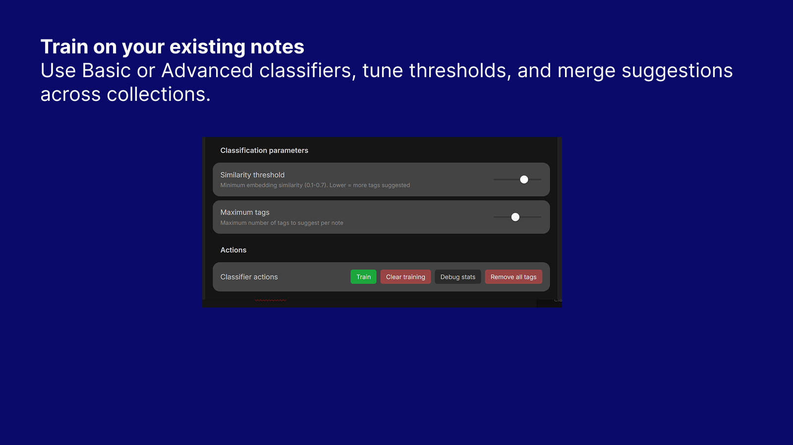
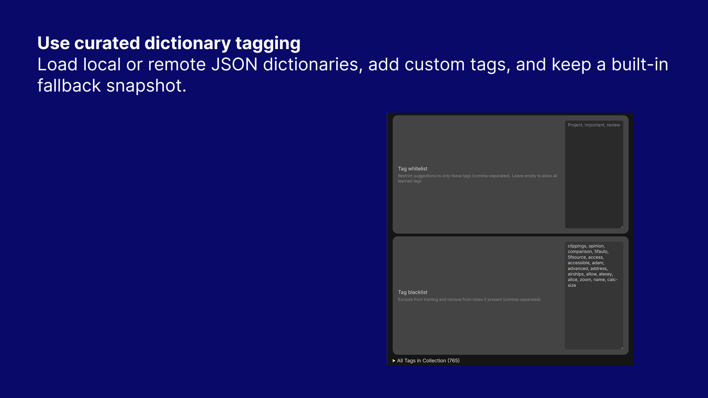

# Auto Tagger for Obsidian


Suggest and apply tags across multiple note collections using learned classifiers or static dictionaries. Auto Tagger helps you keep large vaults organized without manually maintaining every tag by hand.

Auto Tagger is designed for vaults where one tagging strategy is not enough. You can create separate collections for work notes, research, writing, projects, clipped articles, or any other area of your vault, and each collection can use its own scope, thresholds, filters, and dictionary source.

## Why Auto Tagger

- Keep different parts of the vault separated with independent tagging logic
- Train on your existing notes when you already have a good tag history
- Use static dictionaries when you want curated, predictable tag suggestions
- Merge suggestions from multiple collections when a note belongs to more than one context
- Clean up blacklisted tags automatically during suggestion and batch operations

## Good Fit For

- Knowledge management vaults with multiple domains or workflows
- Article clipping and reading pipelines
- Work and personal vaults that need different tag vocabularies
- Teams or repeatable systems that benefit from shared JSON dictionaries
- Users migrating from manual tagging to assisted tagging

## Screenshots

### Overview



Organize tags by collection.

### Collections And Training



Use Basic or Advanced classifiers, tune thresholds, and merge suggestions across collections.

### Static Dictionary Mode



Load local or remote JSON dictionaries, add custom tags, and keep a built-in fallback snapshot.

#### Dictionary JSON Format

Dictionaries are plain JSON files with the following fields:

```jsonc
{
  // Required — list of tags the classifier can suggest
  "tags": ["javascript", "typescript", "python", "llm", "claude"],

  // Words ignored during content matching (common English words, platform noise, etc.)
  "stopwords": ["the", "and", "with"],

  // Tags that are never suggested and are automatically removed from notes
  "blacklist": ["draft", "todo"],

  // Alias → canonical mapping.
  // The alias word is matched against content, but the canonical name appears in output.
  // Example: content containing "anthropic" will produce the tag "claude".
  "aliases": {
    "anthropic": "claude",
    "gpt-4": "chatgpt",
    "openai": "chatgpt"
  },

  // Macro groups: macro name → list of micro tags that belong to it.
  // When any micro tag is matched, its parent macro tag is added automatically
  // as a bonus (extra) tag that does not count against the per-note tag limit.
  "macros": {
    "llm": ["claude", "chatgpt", "llm", "prompt-engineering", "embeddings"],
    "programming": ["javascript", "typescript", "python", "react"]
  }
}
```

**Two-pass matching** — Static mode runs in two passes:
1. **Micro tags** — content is scored against all tags in the dictionary (up to `maxTags` results).
2. **Macro tags** — matched micro tags are looked up in macro groups; parent macro names are appended as extra tags.

This means a note mentioning "Claude" gets both `claude` and `llm` without the macro consuming one of the regular tag slots.

## ✨ Features

- **Collection-based organization** - Keep multiple independent classifiers, each trained on a different slice of the vault.
- **Dual classifier types** - Choose between Basic for broader suggestions or Advanced for stricter, higher-precision matching.
- **Static dictionary mode** - Skip training entirely and match notes against curated JSON dictionaries.
- **Macro tag promotion** - Define macro groups in the dictionary; when a micro tag matches, its parent macro tag is automatically added as a bonus tag (does not count against the tag limit).
- **Alias resolution** - Map surface forms to canonical tags (e.g. `"anthropic" → "claude"`); the alias word scores against content but the canonical name appears in the output.
- **Front-matter exclusion** - Only the note body is used for matching; YAML front matter is never fed to the classifier.
- **Flexible dictionary sources** - Load dictionaries from the vault, desktop filesystem, or remote URL.
- **Embedded dictionary snapshot** - Imported dictionary content is preserved in settings as a fallback if the source file moves.
- **Smart filtering** - Control suggestions with whitelist, blacklist, thresholds, maximum tags, and folder scopes.
- **Multi-collection aggregation** - Merge the best suggestions from all applicable collections.
- **Duplicate prevention** - Never suggest tags already present in the note.
- **Automatic cleanup** - Remove blacklisted tags during processing and batch operations.
- **Batch summaries** - Review detailed reports of added and removed tags across files.
- **Debug and statistics tools** - Inspect training size, top tags, vocabulary, and classifier behavior.
- **Interactive settings UI** - Configure collections, dictionaries, and filters directly inside Obsidian.

## How It Helps

- Turn existing tagged notes into reusable tagging behavior.
- Standardize tag vocabularies across recurring workflows.
- Reduce noisy or generic tags with stricter per-collection rules.
- Speed up review of inbox, clipping, project, and research notes.
- Keep manual tagging available while reducing repetitive work.

## 📦 Installation

### From Community Plugins (Recommended)

1. Open **Settings** → **Community plugins**
2. Click **Browse** and search for "Auto Tagger"
3. Click **Install**, then **Enable**

### Manual Installation

1. Download `main.js`, `manifest.json`, and `styles.css` from the [latest release](https://github.com/canepa/plugin-obsidian-classifier/releases)
2. Create folder: `<vault>/.obsidian/plugins/auto-tagger/`
3. Copy the three files into this folder
4. Reload Obsidian and enable the plugin in **Settings** → **Community plugins**

## 🚀 Quick Start

### 1. Create Your First Collection

1. Go to **Settings** → **Auto Tagger**
2. Click **+ New Collection**
3. Configure:
   - **Name**: "My Notes"
   - **Folder scope**: All folders
   - **Blacklist**: `todo, draft, private`

### 2. Train the Classifier

1. Click **Train** button
2. Wait for training to complete
3. Check status: "Trained on X documents with Y unique tags"

### 3. Get Tag Suggestions

1. Open any untagged note
2. Press `Ctrl/Cmd + P` → "Suggest tags for current note"
3. Review suggestions and select tags to add

### 4. Optional: Use Static Dictionary Mode

1. Open a collection in **Settings** → **Auto Tagger**
2. Set **Source mode** to **Static dictionary**
3. Configure dictionary source:
  - **Local file** (vault path)
  - **Browse vault**
  - **Browse filesystem** (desktop)
  - **Import from URL** (saved into your vault)
4. Optionally set:
  - **Additional tags** (comma-separated)
  - **Additional stopwords** (comma-separated)

## 📖 Usage Guide

### Collection Setup

Collections let you organize notes with specialized classifiers. Each collection has:

- **Independent scope** - Which folders to process  
- **Tag filters** - Whitelist/blacklist for this collection  
- **Training data** - Learned from notes within scope  
- **Parameters** - Threshold and max tags  

**Example Configuration:**

```yaml
Collection: "Technical Docs"
  Scope: Include folders (programming, tutorials, docs)
  Whitelist: python, javascript, api, database, git
  Threshold: 0.3
  Max tags: 5

Collection: "Research Papers"  
  Scope: Include folders (research, papers)
  Whitelist: machine-learning, nlp, statistics, dataset
  Threshold: 0.4
  Max tags: 3

Collection: "General Notes"
  Scope: All folders
  Blacklist: todo, draft, private
  Threshold: 0.3
  Max tags: 5
```

### Commands

Access via Command Palette (`Ctrl/Cmd + P`):

| Command | Description |
| ------- | ----------- |
| **Train classifier** | Select collection or "All Collections" to train |
| **Debug classifier stats** | View training statistics |
| **Suggest tags for current note** | Get suggestions from applicable collections |
| **Auto-tag current note** | Automatically apply suggestions |
| **Batch tag all notes** | Tag all notes with detailed summary of changes |
| **Batch tag folder** | Tag folder notes with detailed summary of changes |

### Example Dictionaries

The repository includes ready-to-use JSON dictionaries in `dictionaries/`:

- `dictionaries/digital-marketing-english.json`
- `dictionaries/digital-marketing-italian.json`
- `dictionaries/household-english.json`
- `dictionaries/household-italian.json`
- `dictionaries/medium-english.json`

You can reference these files directly from your vault (if copied there), or use them as templates to build your own dictionaries.

### Multi-Collection Workflow

When a note matches multiple collections:

1. Blacklisted tags are automatically removed from the note (if present)
2. All applicable classifiers are queried
3. Suggestions are merged (highest probability per tag)
4. UI shows source: `machine-learning (85%) [Technical Docs]`

**Note:** Blacklist removal happens automatically whenever the plugin processes a note (suggestions, auto-tag, batch operations). You'll see a notification showing which tags were removed.

### Batch Operation Summaries

When running batch operations (tag all notes, tag folder), you'll get a detailed summary modal:

- ✅ **Files modified**: Total count of files with changes
- ➕ **Tags added**: Total number of tags added across all files
- 🗑️ **Tags removed**: Total number of blacklisted tags removed
- 📋 **View details**: Expandable list showing file-by-file breakdown of changes

The details view shows exactly which tags were added or removed for each file, making it easy to verify batch operations.

## ⚙️ Configuration

### Global Settings

- **Auto-tag on save** - Automatically apply tags when saving notes
- **Debug to console** - Show detailed logs in developer console (press `F12` or `Ctrl+Shift+I`)

### Per-Collection Settings

**Source Mode:**

- **Learning (default)** - Train classifier on notes in scope
- **Static dictionary** - Skip training and suggest tags from dictionary matching

In **Static dictionary** mode:

- **Dictionary source** - Vault path, local filesystem path, or URL
- **Additional tags** - Adds extra tags on top of dictionary tags
- **Additional stopwords** - Extra words ignored during content matching

**Classifier Type:**

- **Basic (TF-IDF)** - Fast, simple TF-IDF embedding classifier  
  - Good for: General use, quick training, smaller collections
  - Features: Word-level TF-IDF embeddings, cosine similarity, 40% overlap threshold
  - Weighting: 70% similarity, 30% overlap
- **Advanced (Enhanced)** - Stricter filtering for higher precision
  - Good for: Specialized content, avoiding false positives, quality over quantity
  - Features:
    - **Dual filtering** - Pass if similarity ≥55% OR (similarity ≥45% AND overlap ≥25%)
    - **Adaptive weighting** - Dynamically adjusts similarity vs overlap importance
    - **Semantic prioritization** - Favors topically-relevant tags over generic keyword matches
    - **Better discrimination** - Enhanced TF-IDF with defensive NaN handling

**Folder Scope:**

- **All folders** - Process entire vault
- **Include specific** - Only process listed folders
- **Exclude specific** - Process all except listed folders

**Tag Filtering:**

- **Whitelist** - Restrict suggestions to only these tags (empty = allow all learned tags)
- **Blacklist** - Exclude from training, never suggest, and **automatically remove from notes** if present

**Classification Parameters:**

- **Similarity threshold** (0.1-0.7)
  - 0.1-0.2: Very liberal
  - 0.3-0.4: Balanced (recommended)
  - 0.5-0.7: Very strict
- **Maximum tags** (1-10) - Limit suggestions per collection

### Collection Management

- **Enable/Disable** - Toggle collections without deleting
- **Duplicate** - Copy configuration to new collection
- **Delete** - Permanently remove collection
- **Clear training** - Delete trained data and start fresh
- **Remove all tags** - Remove all collection tags from files in scope (shows detailed summary)
- **Debug stats** - View vocabulary size, top tags, training date, and distinctive words
- **All Tags View** - See trained tags with document counts

## 🔧 How It Works

### Architecture

The plugin uses **embedding-based semantic classification** with TF-IDF vectors:

1. **Collection-Based**: Each collection maintains an independent classifier
2. **Dual Classifier Types**:
   - **Basic**: TF-IDF embeddings with 40% overlap filter, 70/30 similarity/overlap weighting
   - **Advanced**: Enhanced filtering (55% threshold OR 45%+25% overlap), adaptive weighting, semantic prioritization
3. **Two-Pass Training**:
   - Pass 1: Build vocabulary and document frequency statistics
   - Pass 2: Generate 1024-dimensional embeddings for each tag
4. **TF-IDF Vectors**: Combines term frequency (with BM25 saturation) and inverse document frequency (boosted formula)
5. **Cosine Similarity**: Measures semantic similarity between note and tags
6. **Distinctive Words**: Top 20 high-IDF terms per tag for overlap calculation
7. **Multi-Classifier Query**: Aggregates suggestions from all applicable collections
8. **Debug Mode**: Optional detailed logging of classification pipeline for optimization

### Why This Works

- **Multi-label support** - Handles notes with multiple relevant tags
- **Semantic understanding** - Captures meaning through word co-occurrence patterns
- **Precision control** - Choose between broader coverage (Basic) or higher quality (Advanced)
- **Discriminative filtering** - Prevents false positives via distinctive word matching
- **Collection isolation** - Technical notes don't interfere with creative writing
- **Scalability** - Add collections without retraining everything
- **Defensive programming** - Object.create(null) prevents prototype pollution, NaN detection prevents corruption

## 💡 Tips & Best Practices

### Training

- Start with **50+ tagged notes** per collection for best results
- Use **consistent, meaningful tags** in frontmatter
- **Retrain regularly** as you add more notes
- **Specialized collections** produce more accurate suggestions

### Classifier Selection

- **Basic classifier**: Fast, broader coverage, good for general collections
  - Use when you want more tag suggestions
  - 40% overlap + 70/30 weighting
- **Advanced classifier**: Stricter, higher precision, fewer false positives
  - Use for specialized collections (technical docs, research papers)
  - 55% threshold OR (45% + 25% overlap)
  - Prioritizes semantic relevance over generic keywords

### Debugging & Optimization

- **Enable debug mode** in settings to see classification pipeline
- **Check console** (`F12` or `Ctrl+Shift+I`) to see:
  - Document and tag embeddings (non-zero dimensions, magnitude)
  - Similarity scores and overlap percentages
  - Distinctive words matching
  - Filter condition evaluation
- **View detailed stats** - Click "Debug stats" button to see:
  - Vocabulary size and average docs per tag
  - Top tags by document count
  - Training date and classifier type
  - Distinctive words per tag average
- **Adjust thresholds** based on debug output

### Collection Strategy

- Start with one general collection (Basic classifier)
- Add specialized collections as themes emerge (consider Advanced for these)
- Overlapping scopes are OK - suggestions merge
- Use "All Collections" for batch operations

## 🐛 Troubleshooting

**No suggestions appearing:**

- Verify note is in scope of an enabled collection
- Check that collections are trained (click "Debug stats" to verify)
- Look for blacklisted tags
- Enable debug mode and check console logs (`F12`)

**Irrelevant suggestions:**

- Try **Advanced classifier** for stricter filtering (55% threshold)
- Increase similarity threshold in collection settings (0.4-0.5)
- Check which collection suggested it (shown in brackets)
- Add to blacklist or narrow collection scope
- Enable debug mode to see similarity scores and matching words

**Too few suggestions:**

- Try **Basic classifier** for broader coverage (40% threshold)
- Lower similarity threshold (0.2-0.3)
- Check whitelist isn't too restrictive
- Verify enough training data (50+ tagged notes recommended)

**Training issues:**

- Check console for errors (`F12`)
- Expected warning: "Skipping word 'constructor'" (safe to ignore)
- If NaN errors appear, retrain collection (defensive checks will handle it)

**Debug mode:**

- Enable in Settings → Auto Tagger → Debug to console
- Shows classification pipeline details in console
- Logs embedding generation, similarity calculations, filter evaluation
- Use "Debug stats" button for summary statistics

## 🛠️ Development

### Setup

```bash
git clone https://github.com/canepa/plugin-obsidian-classifier.git
cd plugin-obsidian-classifier
npm install
```

### Scripts

```bash
npm run dev      # Development build
npm run build    # Production build with linting and type checking
npm run lint     # Check code for guideline violations
npm run lint:fix # Auto-fix linting issues where possible
npm run deploy   # Build and deploy to vault
npm run watch    # Development build + deploy
```

### Code Quality

The project uses ESLint with the official [Obsidian ESLint plugin](https://github.com/obsidianmd/eslint-plugin) to enforce community plugin guidelines:

- **Automatic checks** - Linting runs on every build
- **Obsidian rules** - Catches violations before submission
  - No forbidden DOM elements (innerHTML security)
  - No inline styles (use CSS classes)
  - Proper heading APIs (Setting.setHeading())
  - Sentence case for UI text
  - iOS-compatible regex patterns
- **TypeScript rules** - Unused variables, explicit any types
- **Auto-fix** - Many issues can be fixed automatically with `npm run lint:fix`

### Configuration

For development deployment:

1. Copy the example configuration:

   ```bash
   cp deploy.config.example.ps1 deploy.config.ps1
   ```

2. Update `deploy.config.ps1` with your vault path:

   ```powershell
   $pluginDir = "C:\path\to\vault\.obsidian\plugins\obsidian-auto-tagger"
   ```

3. The `deploy.config.ps1` file is git-ignored to keep your local paths private

## 📄 License

MIT License - see [LICENSE](LICENSE) file for details

## 👤 Author

Alessandro Canepa

- GitHub: [@canepa](https://github.com/canepa)
- Repository: [plugin-obsidian-classifier](https://github.com/canepa/plugin-obsidian-classifier)

## 🙏 Acknowledgments

Built with the [Obsidian API](https://github.com/obsidianmd/obsidian-api)

---

**Minimum Obsidian Version:** 0.15.0
